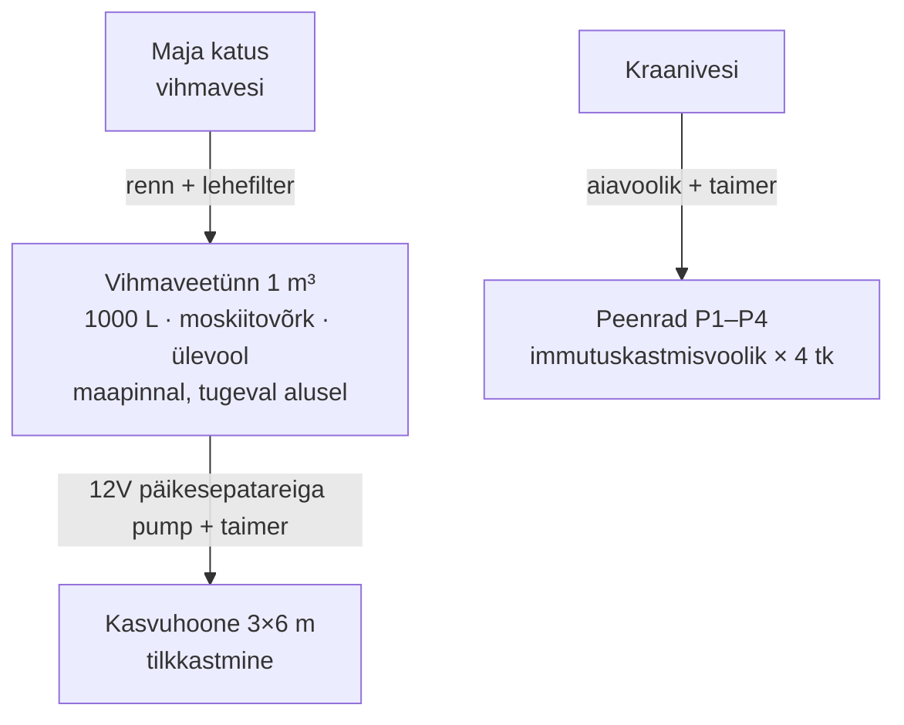
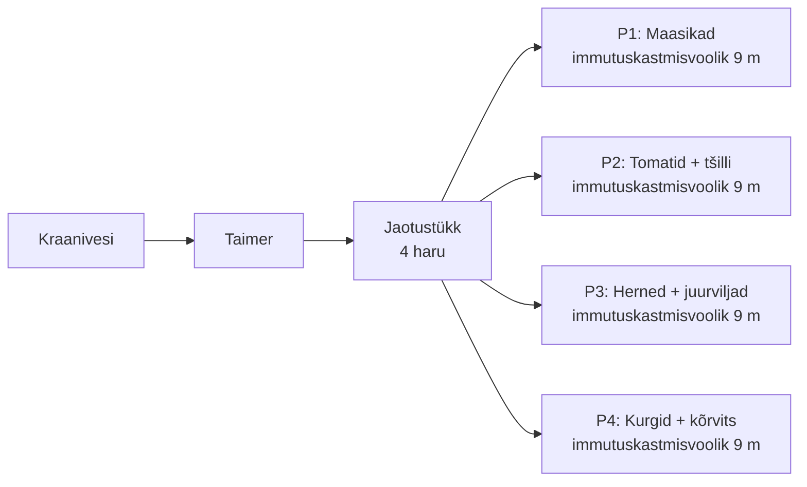

# Kastmine ja veemajandus

Kastmisjuhend kaevamisvaba aia peenardele, kasvuhoonele ja marjapõõsastele.

---

## Kastmise põhitõed

### Kolm põhireeglit

| Reegel | Miks |
|--------|------|
| **Kasta mulda, mitte lehti** | Märjad lehed = seenhaigused (lehemädanik, jahukaste, hallhallitus) |
| **Kasta harvemini, aga sügavalt** | Sügav kastmine julgustab juuri sügavamale kasvama = tugevam taim |
| **Kasta hommikul** | Muld jõuab päeval kuivada, lehed ei jää ööseks märjaks |

### Kastmise aeg

| Aeg | Sobivus | Märkused |
|-----|---------|----------|
| **Hommik (6–10)** | Parim | Vesi imendub enne kuumust, lehed kuivavad |
| **Õhtu (18–20)** | Hea | Ei aurustu, aga lehed jäävad ööseks niiskemaks |
| **Keskpäev (11–16)** | Vältida | 30–50% veest aurustub, lehed võivad kõrbeda |

### Kõrgendatud no-dig peenrad kuivavad kiiremini

Sinu puukastid (1 × 9 m) kuivavad kiiremini kui maapealsed peenrad:
- Puust küljed lasevad niiskust välja
- Kõrgendatud asend = tuul kuivatab rohkem
- **Multš on kriitiline** — 5–10 cm multš (hein, põhk) vähendab aurumist 50–70%
- Komposti kiht (no-dig põhimõte) hoiab samuti niiskust hästi

### Kui palju on "sügav kastmine"?

| Olukord | Vee kogus | Tulemus |
|---------|-----------|---------|
| Pindmine (1–2 L/m²) | Ainult pind märg | Juured kasvavad pinnale, taim nõrk |
| **Keskmine (5–10 L/m²)** | Niiskus 10–15 cm | Piisav enamikele köögiviljadele |
| **Sügav (15–20 L/m²)** | Niiskus 20–30 cm | Puud, põõsad, sügavajuursed kultuurid |

**Lihtne kontroll:** torka sõrm 5–7 cm sügavusele mulda. Kui kuiv — kasta. Kui niiske — oota.

---

## Vihmavee kogumine

### Süsteemi ülevaade

### Katuse kogumise maht

| Katusepind | Sademed kuus (suvi) | Kogutav vesi kuus |
|------------|---------------------|-------------------|
| 30 m² | ~65 mm | **~1950 L** |
| 50 m² | ~65 mm | **~3250 L** |
| 80 m² | ~65 mm | **~5200 L** |

Arvestus: kogumine 100%-st sademest pole reaalne → korruta 0.8-ga.

**Tulemus:** Isegi 30 m² katusest kogud suvel ~1500–2000 L kuus. 1 m³ tünn täitub ~2–3 korda kuus — rohkem kui kasvuhoone vajab. Tünn on "pudelikael", mitte vihm.

⚠️ **Ülevool on kohustuslik!** Lisa ülevoolukraanike tünni ülaossa, mis suunab liigvee eemale majast.

### Vihmavee eelised

| Eelis | Selgitus |
|-------|----------|
| **Soe** | Tünnis soojeneb päikese käes 18–25°C-ni — taimed armastavad |
| **Pehme** | Ei sisalda lupja ega kloori |
| **Tasuta** | Ei suurenda veearvet |
| **Õige pH** | Vihmavesi pH ~6.0–6.5, taimedele ideaalne |

---

## Kasvuhoone tilkkastmine (päikesepatareiga pump)

Vihmaveetünn maapinnal + päikesepatareiga pump + tavaline tilkkastmine. Tünn ei pea olema kõrgel — pump annab piisava rõhu.

### Miks pump, mitte gravitatsioon?

Gravitatsiooniga tilkkastmine vajab tünni 1.5–2 m kõrgusele tõstmist (1 m³ vett = 1 tonn!). Päikesepatareiga pump on lihtsam, odavam ja töökindlam:

| Omadus | Gravitatsioon | Päikesepump |
|--------|---------------|-------------|
| Tünni asukoht | 1.5–2 m kõrgusel, tugev alus | Maapinnal, lihtne alus |
| Tilgutite tüüp | Spetsiaalsed madalarõhu | Tavalised (odavamad, laiemalt saadaval) |
| Rõhk | 0.1–0.2 bar (piiratud) | 0.5–1.0 bar (piisav) |
| Automatiseerimine | Keeruline (mehaaniline taimer) | Lihtne (elektrooniline taimer) |
| Ehituslik risk | 1 tonn kõrgel = oht | Puudub |

### Komponendid

| Komponent | Kirjeldus | Ligikaudne hind |
|-----------|-----------|-----------------|
| **Päikesepaneel (20–30W)** | Paigalda kasvuhoone katusele või kõrvale, lõunasse | ~30–50 € |
| **12V alalisvoolu pump (3–5 L/min)** | Uppuv või pinnapealne, tünni sisse/külge | ~25–40 € |
| **Elektrooniline taimer** | Juhib pumpa (nt 2× päevas, 15–30 min) | ~20–30 € |
| **Aku (valikuline, 7–12 Ah)** | Pilvise ilma puhver, kastmine ka hommikul/õhtul | ~15–25 € |
| **Lehefilter rennile** | Takistab prahi tünni jõudmist | ~10–20 € |
| **Moskiitovõrk tünni avale** | Sääsed munevad seisnud vette! | ~5 € |
| **Sõelfilter (120–200 mesh)** | Pumba järel, enne tilguteid | ~10–20 € |
| **Peatoru (16 mm PE)** | Tünnist kasvuhoonesse + kasvuhoone pikkuses | ~10–15 € |
| **Tavalised tilgutid (2–4 L/h)** | Iga taime juurde | ~10–20 € |
| **Ülevoolukraanike** | Tünni ülaosas, suunab liigvee eemale majast | ~5–10 € |
| **Kokku** | | **~140–250 €** |

### Paigaldus

1. **Tünn tugeva aluse peale** maapinnale (tasane, et ei kalduks)
2. **Lehefilter** rennile → prahl ei satu tünni
3. **Moskiitovõrk** tünni avale
4. **Ülevoolukraanike** tünni ülaossa (~5 cm servast allpool)
5. **Pump** tünni sisse (uppuv) või külge (pinnapealne)
6. **Sõelfilter** pumba väljundile
7. **PE-toru** tünnist kasvuhoonesse
8. **Tilgutid** iga taime juurde (tomat, kurk, arbuus)
9. **Päikesepaneel** kasvuhoone katusele või kõrvale, lõuna poole
10. **Taimer** pumba ja paneeli vahele

### Taimeri seadistus

| Periood | Käivitusi päevas | Kestus | Märkused |
|---------|-----------------|--------|----------|
| Mai (taimed väiksed) | 1× | 10–15 min | Hommikul |
| Juuni | 1× | 15–20 min | Hommikul |
| Juuli (tippaeg) | 2× | 15–20 min | Hommik + õhtu |
| August | 1–2× | 15–20 min | Vastavalt ilmale |
| September | 1× | 10 min | Vajaduse järgi |

⚠️ **Akuga variant on soovituslik.** Ilma akuta töötab pump ainult siis, kui päike paistab. Akuga saab kastmise ajastada hommikuks (parim aeg), isegi kui on pilvine.

### Pumba valik

**Uppuv pump (submersible):**
- Asetad tünni sisse, imeb vett alt
- Vaiksem, lihtsam paigaldada
- Puudus: kui tünn saab tühjaks, pump töötab kuivalt (kahjulik)
- **Soovitus:** lisa ujukiga lüliti, mis lülitab pumba välja kui veetase liiga madal

**Pinnapealne pump:**
- Kinnitad tünni kõrvale, imab voolikuga
- Natuke mürarikkam
- Eelis: ei tööta kuivalt, lihtsam hooldada

---

### Kasvuhoone veevajaduse arvutus

**Sinu kasvuhoone kultuurid ja nende vajadus:**

| Kultuur | Taimi | Liitrit/taim/päev (tippaeg) | Kokku päevas |
|---------|-------|---------------------------|--------------|
| Tomat | 6–8 tk | 2–3 L | 12–24 L |
| Kurk 'Suyu Long' | 3–4 tk | 3–4 L | 9–16 L |
| Arbuus | 1–2 tk | 3–5 L | 3–10 L |
| Muud (basiilik jm) | – | ~1 L | ~2–3 L |
| **KOKKU** | | | **~25–50 L/päevas** |

**Tünni kestvus:**

| Periood | Vajadus päevas | 1000 L kestab |
|---------|----------------|---------------|
| Mai–juuni (taimed väiksed) | ~10–20 L | **50–100 päeva** |
| Juuli (tippaeg) | ~35–50 L | **20–28 päeva** |
| August–september | ~25–35 L | **28–40 päeva** |

**Järeldus:** 1 m³ tünn katab kasvuhoone vajaduse mugavalt, sest vihm täidab tünni suvel 2–3× kuus. Ainult pika kuumalaine ajal (10+ päeva ilma vihmata) täienda kraaniveega.

---

## Avamaa peenrad (immutuskastmisvoolik + kraanivesi)

Kasvuhoone saab vihmavee, peenrad saavad kraanivee. Immutuskastmisvoolik (soaker hose / lekvoolik) on peenardele parim lahendus: odav, lihtne ja ühtlane.

### Miks mitte kastekannuga?

Tippaeg (juuli, kuumalaine): 4 peenart vajavad korraga **220–290 L**. See on 22–29 korda 10L kastekannuga edasi-tagasi. Ülepäeviti. Seda ei viitsi teha — ja just siis, kui vett on kõige rohkem vaja, jätad vahele.

### Miks immutuskastmisvoolik?

| Eelis | Selgitus |
|-------|----------|
| **Ühtlane niiskus** | Kogu peenra pikkuses, mitte laiguti |
| **Kasta mulda, mitte lehti** | Vesi immub otse mulda = vähem haigusi |
| **Lihtne** | Ühenda voolikuga, keera lahti, oota, keera kinni |
| **Odav** | ~10–15 € / 9 m tükk |
| **Madal rõhk piisav** | Töötab ka väikese veerõhuga |

### Komponendid

| Komponent | Kirjeldus | Ligikaudne hind |
|-----------|-----------|-----------------|
| **Immutuskastmisvoolik** (4 × 9 m) | Poorne voolik, tilgub kogu pikkuses | ~40–60 € |
| **Aiavoolik (kraanist)** | Peatoru peenardeni | Olemasolev |
| **Jaotustükk (4-haruline)** | Üks voolik → 4 peenrale | ~10–15 € |
| **Taimer (kraanile)** | Patareiga, keerab vee lahti/kinni automaatselt | ~15–25 € |
| **Sulgurid igale harule** | Peenrapõhine reguleerimine | ~10 € |
| **Kokku** | | **~75–110 €** |

### Paigaldus

1. **Ühenda taimer** kraanile
2. **Veda aiavoolik** kraanist peenarde juurde
3. **Paigalda jaotustükk** (4 haru)
4. **Aseta immutuskastmisvoolik** igale peenrale piki keskjoont
5. **Kata voolik multšiga** (5 cm hein/põhk) — hoiab vooliku paigal, vähendab aurumist
6. **Sulge otsad** vooliku sulguriga või voltimise + klambriga

### Taimeri seadistus

| Periood | Sagedus | Kestus | Märkused |
|---------|---------|--------|----------|
| Mai–juuni algus | Ülepäeviti | 30 min | Muld veel niiske, taimed väiksed |
| Juuni lõpp – juuli | Iga päev | 30–45 min | Tippaeg |
| Kuumalaine (>25°C, tuuline) | Iga päev | 45–60 min | Kõrgendatud peenrad kuivavad kiiresti |
| August | Iga päev / ülepäeviti | 30 min | Vastavalt ilmale |
| September | 2× nädalas | 20–30 min | Vähenda järk-järgult |

⚠️ **Pärast vihma lülita taimer pausile** (või vali taimer vihmaautomaatikaga). Mõttetu kastmine pärast vihma = vee raiskamine ja ülekastmine.

### Peenrapõhine reguleerimine sulguritega

Kõik 4 peenart ei vaja sama palju vett:

| Peenar | Veevajadus | Sulguriseis |
|--------|-----------|-------------|
| P1: Maasikad | Keskmine | 70–80% avatud |
| P2: Tomatid | Keskmine | 70–80% avatud |
| P3: Herned + porgand | Madalam | 50–60% avatud |
| P4: Kurgid + kõrvits | Kõrgeim | 100% avatud |

Reguleeri hooaja alguses ja korrigeeri vastavalt taimede seisundile.

---

## Kogu süsteemi kokkuvõte

| Ala | Veeallikas | Kastmismeetod | Automatiseerimine | Ligikaudne hind |
|-----|-----------|---------------|-------------------|-----------------|
| **Kasvuhoone** (18 m²) | Vihmaveetünn 1 m³ | Tilkkastmine (pump) | Päikesepatareiga pump + taimer | ~140–250 € |
| **Peenrad P1–P4** (36 m²) | Kraanivesi | Immutuskastmisvoolik | Taimer kraanile | ~75–110 € |
| **Kokku** | | | | **~215–360 €** |

Mõlemad süsteemid on automatiseeritud — kasvuhoone vihmaveega, peenrad kraaniveega.

---

## Kastmisvajadus kultuuride kaupa

### Kasvuhoone

| Kultuur | Sagedus | Kogus taime kohta | Kriitilised märgid | Erinõuded |
|---------|---------|-------------------|---------------------|-----------|
| **Tomat** | 2–3× nädalas | 2–3 L korraga | Lehed keerduvad, lõhenenud viljad, õietipp-mädanik | Ühtlane niiskus! Kõikuv kastmine = lõhenemised ja õietipp-mädanik |
| **Kurk** | Iga päev / ülepäeviti | 3–4 L korraga | Lehed longus, kurgid kibed, kuju imelik | Kõige veenõudlikum! Ei talu kuivust |
| **Arbuus** | 2–3× nädalas → harvemini | 3–5 L korraga | Lehed kuivavad servadest | Vähenda kastmist vilja küpsemisel (magusam!) |
| **Basiilik** | Ülepäeviti | 0.5 L | Lehed langevad alla | Ei talu üleujutamist |

**⚠️ Tomatite õietipp-mädanik (blossom end rot):**
See POLE haigus. See on kaltsiumi omastamise häire ebaühtlase kastmise tõttu. Lahendus: kasta regulaarselt, mitte kord nädalas üleujutus. Tilkkastmine lahendab selle probleemi täielikult.

### Avamaa peenrad (1 × 9 m, puukast)

#### Peenar 2: Maavitsalised

| Kultuur | Sagedus (tavaline suvi) | Kogus | Märkused |
|---------|------------------------|-------|----------|
| **Tomat (avamaa)** | 2–3× nädalas | 2–3 L / taim | Ühtlane niiskus kriitilisem kui kasvuhoones |
| **Tšilli** | 2× nädalas | 1–2 L / taim | Talub kuivust paremini kui tomat |
| **Füüsal** | 2× nädalas | 1.5–2 L / taim | Sarnane tomatiga |

#### Peenar 3: Liblikõielised + juurviljad

| Kultuur | Sagedus | Kogus | Märkused |
|---------|---------|-------|----------|
| **Herned** | 2× nädalas | 5 L/jm | Kriitilisim: õitsemise ajal! Kuivus = tühjad kaunad |
| **Aeduba** | 2× nädalas | 5 L/jm | Sarnane hernega, kriitilisim õitsemisel |
| **Porgand** | 1× nädalas | 5–8 L/jm | Liiga palju vett = kahveljuured. Ühtlane niiskus = sirged porgandid |
| **Sibul** | 1× nädalas → lõpeta | 3–5 L/jm | **Lõpeta kastmine 2–3 nädalat enne koristust!** (kuivatus) |
| **Porru** | 2× nädalas | 5 L/jm | Regulaarne niiskus kogu hooaja |

#### Peenar 4: Kõrvitsalised

| Kultuur | Sagedus | Kogus | Märkused |
|---------|---------|-------|----------|
| **Kurk (avamaa)** | Iga päev (kuumus) / ülepäeviti | 3–4 L / taim | Kõige veenõudlikum avamaal! |
| **Suvikõrvits** | 2–3× nädalas | 5 L / taim | Suured lehed auruvad palju |
| **Patisson** | 2–3× nädalas | 5 L / taim | Sarnane suvikõrvitsaga |

#### Peenar 1: Maasikad

| Periood | Sagedus | Kogus | Märkused |
|---------|---------|-------|----------|
| Kevad (aprill–mai) | 1× nädalas | 5 L/jm | Ainult kui kuiv |
| **Õitsemine (mai lõpp)** | 2× nädalas | 5–8 L/jm | Kriitilisim periood! |
| **Viljumine (juuni–juuli)** | 2–3× nädalas | 8–10 L/jm | Suuremad, mahlasemad marjad |
| Pärast saaki (august) | 1× nädalas | 5 L/jm | Vähenda, aga ära lõpeta |

### Marjapõõsad ja viljapuud

| Kultuur | Sagedus | Kogus | Millal kriitilisim |
|---------|---------|-------|---------------------|
| **Vaarikas** | 1–2× nädalas | 10–15 L / põõsas | Marjade arenemisel (juuni–juuli) |
| **Sõstar** | 1× nädalas | 10–15 L / põõsas | Marjade arenemisel |
| **Kuslapuu** | 1–2× nädalas | 10–15 L / põõsas | Mai–juuni (varajane!) |
| **Karusmari** | 1× nädalas | 10 L / põõsas | Marjade arenemisel |
| **Õunapuu** | 1× nädalas kuumaga | 20–30 L / puu | Vilja arenemisel (juuli–august) |
| **Kirsipuu** | 1× nädalas kuumaga | 20–30 L / puu | Vilja arenemisel |

**Täiskasvanud puud (5+ aastat):** Enamasti tulevad ise toime. Kasta ainult pika kuumuse ajal (7+ päeva ilma vihmata).

---

## Kriitilised kastmisperioodid

**See on kõige olulisem tabel selles failis.** Nendel hetkedel maksab 1 kastmine ennast saagis 10-kordselt tagasi. Muul ajal saavad taimed enam-vähem ise hakkama.

| Kultuur | Kriitilisim periood | Miks | Tulemus kui kuiv |
|---------|---------------------|------|------------------|
| **Tomat** | Õitsemine + vilja kasv (juuni–juuli) | Õied kukuvad, viljad lõhenevad, õietipp-mädanik | Kuni 50% saagikadu |
| **Kurk** | Kogu saagiaeg (juuli–sept) | Kibedate kurkide peamine põhjus on veestress | Kibedad, konksus kurgid |
| **Herned** | Õitsemine (juuni) | Õied kukuvad, kaunad tühjad | Kuni 70% saagikadu |
| **Aeduba** | Õitsemine (juuli) | Õied kukuvad | Kuni 50% saagikadu |
| **Porgand** | Juure paksenemine (juuli–august) | Ebaühtlane niiskus = lõhenenud / kahvljuured | Deformeerunud saak |
| **Kartul** | Mugulate arenemine (juuni) | Väiksemad mugulad, nuuter | Kuni 40% saagikadu |
| **Maasikas** | Õitsemine + viljumine (mai–juuli) | Väiksemad, kuivemad marjad | Kuni 30% saagikadu |
| **Sõstar** | Marjade kasv (juuni) | Marjad jäävad väikseks, varisevad | Kuni 40% saagikadu |
| **Õunapuu** | Vilja kasv (juuli–august) | Väiksemad õunad, erakorraline viljude heide | Kuni 30% saagikadu |

---

## Üle- ja allakaastmise tunnused

### Allakaastmine (liiga kuiv)

| Tunnus | Kultuur | Mida teha |
|--------|---------|-----------|
| Lehed longus **pärastlõunal**, hommikul taastuvad | Tomat, kurk, kõrvits | Normaalne kuumal päeval — kasta õhtul |
| Lehed longus **hommikul** ega taastu | Kõik | Tõsine kuivus! Kasta kohe, sügavalt |
| Lehed keerduvad sissepoole | Tomat | Veestress, kasta ühtlasemalt |
| Leheservad pruunistuvad ja kuivavad | Porgand, herned | Vajab vett |
| Kurgid kibedad | Kurk | Kuivusestress muudab maitse kibedaks |
| Viljad väiksed, kõvad | Maasikas, tomat | Liiga vähe vett viljumise ajal |
| Õied kukuvad maha | Tomat, herned, uba | Kriitiline! Kasta kohe |

### Ülekastmine (liiga märg)

| Tunnus | Kultuur | Mida teha |
|--------|---------|-----------|
| Lehed kollased (alumiselt) | Tomat, kurk | Juured "uppuvad" — lase kuivada |
| Vars pehmeneb tüve ääres | Seemikud, basiilik | Juuremädanik! Vähenda kastmist |
| Seenhaigused (hallhallitus, jahukaste) | Kõik | Kasta harvemini, tuuluta |
| Nälkjad ja teod kogunevad | Maasikas, salat | Liiga niiske keskkond |
| Porgandid lõhenevad | Porgand | Liiga suur niiskuse kõikumine |

### "Sõrmeproov"

Lihtsaim viis kastmise vajadust hinnata:

1. **Torka sõrm 5–7 cm sügavusele** mulda
2. **Märg?** → ära kasta
3. **Niiske (nagu välja pigistatud käsn)?** → ideaalne, ära kasta
4. **Kuiv?** → kasta

Tee proovi **hommikul** — pärastlõunal on pind alati kuivem.

---

## Praktiline kastmiskalender

### Aprill–mai (varakevad)

- Muld on enamasti niiske lumesulast ja vihmadest
- Kasta ainult kui 5+ päeva kuiva
- **Uued istikud** vajab kastmist istutamisel (1–2 L istutusauku)
- Kasvuhoone: alusta kerget kastmist mai keskpaigas

### Juuni (kasvuperiood algab)

- Istutamisel: põhjalik kastmine (3–5 L / taim)
- Esimesed 2 nädalat pärast istutamist: kasta iga 2–3 päeva
- Kuu lõpus: üle minna tavalisele kastmisrežiimile
- **Maasikad:** kriitilisim kuu! 2–3× nädalas

### Juuli (tippaeg)

- Kõige suurem veevajadus
- Kuumalaine (25°C+): kasta iga päev (kasvuhoone) / ülepäeviti (peenrad)
- **Kontroll iga hommik:** sõrmeproov
- **Herneste** viimane kriitilisim kastmine (õitsemine)

### August (veel kõrge)

- Veevajadus jätkuvalt kõrge
- **Sibul:** lõpeta kastmine 2–3 nädalat enne koristust
- **Küüslauk:** sama — kuivata enne koristust
- Kasvuhoone: jätkuvalt igapäevane

### September–oktoober

- Vähenda kastmist järk-järgult
- Kasvuhoone: ainult vajadusel (saak lõppemas)
- **Puud ja põõsad:** kui kuiv sügis, kasta korra enne talve läbi (niiskus kaitset külma eest)

---

## Vihmaveetünni hooldus

### Hooajal

- [ ] Kontrolli lehefiltrit iga kuu (puhasta)
- [ ] Kontrolli tilkkastmise filtrit iga 2 nädalat
- [ ] Moskiitovõrgu seisukorra kontrollimine
- [ ] Ülevoolukraaniku töötamise kontrollimine

### Talveks (oktoober–november)

- [ ] **Tühjenda tünn enne püsivat külma!** (jää lõhub tünni)
- [ ] Eemalda voolik ja tilkkastmise osad kasvuhoonest
- [ ] Hoiusta filter siseruumis
- [ ] Keera tünn kummalei (jää ei kogu)
- [ ] Või: jäta tünni kraanike lahti (vesi ei kogu)

### Kevadeks (märts–aprill)

- [ ] Puhasta tünn seest
- [ ] Kontrolli kraaniku ja ühenduste tihendeid
- [ ] Paigalda tilkkastmine kasvuhoonesse
- [ ] Taasta rennilt ühendus

---

## Seotud failid

- **Muld ja väetamine:** [muld-ja-vaetamine.md](muld-ja-vaetamine.md) — multš ja mulla niiskusehoid
- **Kasvuhoone:** [kasvuhoone/kasvuhoone-plaan.md](kasvuhoone/kasvuhoone-plaan.md) — kasvuhoone kliima juhtimine
- **Hooajaline kalender:** [hooajaline-kalender.md](hooajaline-kalender.md) — kuupõhised tööd
- **Varustus:** [varustus-ja-toeriistad.md](varustus-ja-toeriistad.md) — kastmisvarustus
